# 🔐 WorkflowHub Authentication System Flow

## Complete User Journey Mermaid Diagram

```mermaid
flowchart TD
    Start([User visits WorkflowHub]) --> Landing[Landing Page]

    Landing --> AuthPage{Auth Page}

    %% Authentication Methods
    AuthPage --> LoginMode[Login Mode]
    AuthPage --> RegisterMode[Register Mode]
    AuthPage --> EnterpriseSSOMode[Enterprise SSO Mode]

    %% Login Flow
    LoginMode --> EmailLogin[Email + Password Login]
    LoginMode --> SocialLogin[Social Login]
    LoginMode --> MagicLink[Magic Link Login]
    LoginMode --> ForgotPassword[Forgot Password?]

    %% Password Reset Flow
    ForgotPassword --> PasswordResetFlow[Password Reset Flow]
    PasswordResetFlow --> EnterResetEmail[Enter Email for Reset]
    EnterResetEmail --> SendResetEmail[Send Reset Email]
    SendResetEmail --> ResetEmailSent[Reset Email Sent]
    ResetEmailSent --> ClickResetLink[User Clicks Reset Link]
    ClickResetLink --> ValidateResetToken{Reset Token Valid?}
    ValidateResetToken -->|Yes| NewPasswordForm[Enter New Password]
    ValidateResetToken -->|No| ResetTokenError[Show Error & Retry]
    NewPasswordForm --> PasswordResetSuccess[Password Reset Complete]
    PasswordResetSuccess --> LoginMode

    %% Enterprise SSO Flow
    EnterpriseSSOMode --> SSOMethodChoice{SSO Discovery Method}
    SSOMethodChoice --> DomainDiscovery[Enter Company Domain]
    SSOMethodChoice --> ProviderSelection[Select SSO Provider]
    SSOMethodChoice --> ManualSSO[Manual SSO URL]

    DomainDiscovery --> AutoDiscoverSSO[Auto-Discover SSO Config]
    AutoDiscoverSSO --> SSORedirect[Redirect to SSO Provider]

    ProviderSelection --> PopularProviders{Choose Provider}
    PopularProviders --> OktaSSO[Okta]
    PopularProviders --> AzureADSSO[Azure AD]
    PopularProviders --> GoogleWorkspaceSSO[Google Workspace]
    PopularProviders --> OneLoginSSO[OneLogin]
    PopularProviders --> Auth0SSO[Auth0]

    OktaSSO --> SSORedirect
    AzureADSSO --> SSORedirect
    GoogleWorkspaceSSO --> SSORedirect
    OneLoginSSO --> SSORedirect
    Auth0SSO --> SSORedirect

    ManualSSO --> EnterSSOURL[Enter SSO URL]
    EnterSSOURL --> SSORedirect

    SSORedirect --> SSOAuthentication[SSO Provider Authentication]
    SSOAuthentication --> SSOCallback{SSO Success?}
    SSOCallback -->|Yes| SSOLoginSuccess[SSO Login Successful]
    SSOCallback -->|No| SSOError[SSO Error & Retry]

    %% Social Authentication
    SocialLogin --> GoogleAuth[Google OAuth]
    SocialLogin --> GitHubAuth[GitHub OAuth]
    SocialLogin --> MicrosoftAuth[Microsoft OAuth]

    GoogleAuth --> SocialSuccess{Social Auth Success?}
    GitHubAuth --> SocialSuccess
    MicrosoftAuth --> SocialSuccess

    SocialSuccess -->|Yes| CheckExistingUser{Existing User?}
    SocialSuccess -->|No| AuthError[Show Error & Retry]

    CheckExistingUser -->|Yes| LoginSuccess[Login Successful]
    CheckExistingUser -->|No| AutoRegister[Auto-Register with Social Data]

    %% Email/Password Login
    EmailLogin --> ValidateCredentials{Valid Credentials?}
    ValidateCredentials -->|Yes| Check2FA{2FA Enabled?}
    ValidateCredentials -->|No| LoginError[Show Error & Retry]

    Check2FA -->|Yes| Require2FA[Require 2FA Code]
    Check2FA -->|No| LoginSuccess

    Require2FA --> Verify2FA{2FA Code Valid?}
    Verify2FA -->|Yes| LoginSuccess
    Verify2FA -->|No| TwoFactorError[Show Error & Retry]

    %% Magic Link Flow
    MagicLink --> EnterEmail[Enter Email Address]
    EnterEmail --> SendMagicLink[Send Magic Link Email]
    SendMagicLink --> MagicLinkSent[Email Sent Confirmation]
    MagicLinkSent --> ClickMagicLink[User Clicks Email Link]
    ClickMagicLink --> ValidateToken{Token Valid?}
    ValidateToken -->|Yes| LoginSuccess
    ValidateToken -->|No| TokenError[Show Error]

    %% Registration Flow
    RegisterMode --> SSOOption{Continue with SSO?}
    SSOOption -->|Yes| EnterpriseSSOMode
    SSOOption -->|No| FillRegForm[Fill Registration Form]

    FillRegForm --> PasswordStrength{Password Strong Enough?}
    PasswordStrength -->|No| ShowPasswordHints[Show Password Requirements]
    ShowPasswordHints --> FillRegForm
    PasswordStrength -->|Yes| AcceptTerms{Terms Accepted?}
    AcceptTerms -->|No| RequireTerms[Require Terms Acceptance]
    RequireTerms --> FillRegForm
    AcceptTerms -->|Yes| CreateAccount[Create Account]

    CreateAccount --> RegSuccess{Registration Success?}
    RegSuccess -->|Yes| EmailVerificationFlow[Email Verification Required]
    RegSuccess -->|No| RegError[Show Error & Retry]

    %% Email Verification Flow
    EmailVerificationFlow --> SendVerificationEmail[Send Verification Email]
    SendVerificationEmail --> VerificationEmailSent[Verification Email Sent]
    VerificationEmailSent --> ResendOption{Need to Resend?}
    ResendOption -->|Yes| ResendCooldown{Cooldown Active?}
    ResendCooldown -->|Yes| WaitCooldown[Wait for Cooldown]
    ResendCooldown -->|No| SendVerificationEmail
    WaitCooldown --> ResendOption

    VerificationEmailSent --> ClickVerificationLink[User Clicks Verification Link]
    ClickVerificationLink --> ValidateVerificationToken{Verification Token Valid?}
    ValidateVerificationToken -->|Yes| EmailVerified[Email Verified Successfully]
    ValidateVerificationToken -->|No| VerificationTokenError[Show Error & Retry]
    EmailVerified --> AutoRegister

    %% Post-Login Flow
    LoginSuccess --> CheckOnboarding{Onboarding Completed?}
    SSOLoginSuccess --> CheckOnboarding
    AutoRegister --> CheckOnboarding

    CheckOnboarding -->|No| OnboardingFlow[Start Onboarding]
    CheckOnboarding -->|Yes| Dashboard[Dashboard]

    %% Onboarding Process
    OnboardingFlow --> Step1[Step 1: Company Information]
    Step1 --> CompanyForm[Fill Company Details]
    CompanyForm --> Step2[Step 2: Team & Role Setup]
    Step2 --> RoleForm[Select Role & Team Size]
    RoleForm --> Step3[Step 3: Goals Selection]
    Step3 --> GoalsForm[Choose Project Goals]
    GoalsForm --> Step4[Step 4: First Project]
    Step4 --> ProjectForm[Create First Project]
    ProjectForm --> OptionalTwoFactor{Enable 2FA?}

    %% Two-Factor Setup (Optional)
    OptionalTwoFactor -->|Yes| TwoFactorSetup[2FA Setup Flow]
    OptionalTwoFactor -->|No| CompleteOnboarding[Complete Onboarding]

    TwoFactorSetup --> ShowQR[Show QR Code]
    ShowQR --> ScanQR[User Scans with Auth App]
    ScanQR --> EnterCode[Enter Verification Code]
    EnterCode --> ValidateSetup{Code Valid?}
    ValidateSetup -->|Yes| Show2FABackup[Show Backup Codes]
    ValidateSetup -->|No| SetupError[Show Error & Retry]
    Show2FABackup --> Enable2FA[Enable 2FA]
    Enable2FA --> CompleteOnboarding

    %% Final Steps
    CompleteOnboarding --> UpdateProfile[Update User Profile]
    UpdateProfile --> Dashboard

    %% Dashboard State
    Dashboard --> WorkspaceReady[🎉 Workspace Ready!]

    %% Error Handling
    AuthError --> AuthPage
    LoginError --> LoginMode
    TwoFactorError --> Require2FA
    TokenError --> MagicLink
    RegError --> RegisterMode
    SetupError --> EnterCode
    ResetTokenError --> PasswordResetFlow
    VerificationTokenError --> EmailVerificationFlow
    SSOError --> EnterpriseSSOMode

    %% Styling
    classDef successNode fill:#10b981,stroke:#059669,stroke-width:2px,color:#fff
    classDef errorNode fill:#ef4444,stroke:#dc2626,stroke-width:2px,color:#fff
    classDef processNode fill:#3b82f6,stroke:#2563eb,stroke-width:2px,color:#fff
    classDef decisionNode fill:#f59e0b,stroke:#d97706,stroke-width:2px,color:#fff
    classDef authNode fill:#8b5cf6,stroke:#7c3aed,stroke-width:2px,color:#fff
    classDef emailNode fill:#06b6d4,stroke:#0891b2,stroke-width:2px,color:#fff
    classDef ssoNode fill:#f97316,stroke:#ea580c,stroke-width:2px,color:#fff

    class LoginSuccess,AutoRegister,CompleteOnboarding,Enable2FA,WorkspaceReady,SSOLoginSuccess,EmailVerified,PasswordResetSuccess successNode
    class AuthError,LoginError,TwoFactorError,TokenError,RegError,SetupError,ResetTokenError,VerificationTokenError,SSOError errorNode
    class OnboardingFlow,TwoFactorSetup,CreateAccount,SendMagicLink,EmailVerificationFlow,PasswordResetFlow processNode
    class ValidateCredentials,Check2FA,PasswordStrength,AcceptTerms,CheckOnboarding,OptionalTwoFactor,SSOMethodChoice,ResendOption decisionNode
    class SocialLogin,GoogleAuth,GitHubAuth,MicrosoftAuth,MagicLink authNode
    class SendVerificationEmail,SendResetEmail,VerificationEmailSent,ResetEmailSent emailNode
    class EnterpriseSSOMode,SSORedirect,OktaSSO,AzureADSSO,GoogleWorkspaceSSO,OneLoginSSO,Auth0SSO ssoNode
```



## 🎯 Current Authentication System Features

### 1. **Multi-Modal Authentication**

- **Traditional Login**: Email + Password with validation
- **Social Authentication**: Google, GitHub, Microsoft OAuth
- **Magic Link**: Passwordless email-based authentication
- **Enterprise SSO**: SAML/OIDC with major providers (Okta, Azure AD, Google Workspace, OneLogin, Auth0)
- **Two-Factor Authentication**: TOTP with backup codes

### 2. **Registration & Verification Process**

- **Form Validation**: Real-time password strength checking
- **Terms Acceptance**: Required legal compliance
- **Social Registration**: Auto-account creation from OAuth
- **Email Verification**: Required email confirmation with resend functionality
- **Enterprise SSO Registration**: Direct SSO integration for enterprise users

### 3. **Password Management**

- **Password Reset**: Secure token-based reset with email verification
- **Password Strength**: Visual strength indicator with requirements
- **Reset Token Expiry**: Time-limited reset tokens for security
- **Cooldown Protection**: Rate limiting for password reset requests

### 4. **Enterprise Security Features**

- **Domain Discovery**: Automatic SSO configuration based on email domain
- **Popular Provider Support**: Pre-configured integration with major SSO providers
- **Manual SSO Configuration**: Custom SSO URL support for any SAML/OIDC provider
- **SAML & OIDC**: Support for both major SSO protocols

### 5. **Email Security & Verification**

- **Verification Required**: Mandatory email verification for new accounts
- **Resend Protection**: Smart cooldown periods to prevent email spam
- **Token Validation**: Secure email verification tokens with expiry
- **Email Templates**: Professional verification and reset email templates

### 6. **Session & Security Management**

- **2FA Setup**: Optional TOTP configuration with QR codes
- **Backup Codes**: Recovery codes for 2FA
- **Session Management**: Secure token-based authentication
- **Remember Me**: Persistent login option
- **Secure Logout**: Complete state cleanup

### 7. **User Onboarding Journey**


### 8. **User States & Data**

Current user object structure:

```typescript
interface User {
  id: string;
  name: string;
  email: string;
  emailVerified?: boolean;
  avatar?: string;
  role: "admin" | "manager" | "member";
  companyName?: string;
  companySize?: string;
  industry?: string;
  goals?: string[];
  twoFactorEnabled?: boolean;
  onboardingCompleted?: boolean;
  ssoProvider?: string;
  ssoId?: string;
  lastPasswordReset?: Date;
}
```

### 9. **Navigation Flow**

- **Landing Page** (`/`) → **Auth Page** (`/auth`)
- **Auth Success** → **Email Verification** → **Onboarding** (`/onboarding`) or **Dashboard** (`/dashboard`)
- **Password Reset** → **Reset Email** → **New Password** → **Login**
- **Enterprise SSO** → **SSO Provider** → **Callback** → **Dashboard**
- **Onboarding Complete** → **Dashboard** (`/dashboard`)

## 🔐 Security Implementation

### Authentication Methods Priority:

1. **Enterprise SSO** (Highest security, enterprise compliance)
2. **Social OAuth** (High conversion, lowest friction)
3. **Magic Link** (Secure, passwordless)
4. **Email/Password** (Traditional, with strength validation)
5. **2FA** (Optional security enhancement)

### Email & Password Security:

- **Required Email Verification**: All new accounts must verify email
- **Password Reset Flow**: Secure token-based password recovery
- **Rate Limiting**: Cooldown periods for email operations
- **Token Expiry**: Time-limited verification and reset tokens

### Enterprise Security:

- **SSO Integration**: SAML and OIDC protocol support
- **Domain-based Discovery**: Automatic SSO detection by email domain
- **Provider Flexibility**: Support for custom and popular SSO providers
- **Secure Callbacks**: Proper SSO callback validation

### Session Management:

- **Zustand Persistence**: Local storage with state management
- **Token Refresh**: Automatic session renewal
- **Secure Logout**: Complete state cleanup
- **SSO Session Sync**: Coordinate with SSO provider sessions

## 📊 User Experience Metrics

The current system tracks:

- **Authentication Method Usage**: Social vs Email vs Magic Link vs SSO
- **Email Verification Rates**: Verification completion and resend patterns
- **Password Reset Usage**: Reset request frequency and completion rates
- **SSO Adoption**: Enterprise SSO usage and provider distribution
- **Onboarding Completion Rate**: Step-by-step analytics including verification
- **2FA Adoption**: Security feature uptake
- **Time to First Value**: Registration to dashboard (including verification steps)

Your authentication system now provides enterprise-level security with consumer-grade usability! 🚀

## 🔄 User Authentication States


## 🎯 User Authentication Journey States

### State Descriptions:

1. **Anonymous**

   - No authentication
   - Can access public pages only
   - Redirected to auth for protected routes

2. **Authenticating**

   - Multiple auth methods available (Email/Password, Social, Magic Link, SSO, Password Reset)
   - Form validation and error handling
   - OAuth and SSO redirects and callbacks

3. **Authenticated**

   - Basic auth complete
   - Identity verified
   - Session established
   - May require email verification

4. **EmailVerificationRequired**

   - User authenticated but email not verified
   - Must complete email verification to proceed
   - Can resend verification emails with rate limiting

5. **OnboardingRequired**

   - Email verified user requiring setup
   - New user setup flow
   - Company and profile information
   - Goal-based feature selection
   - Optional security enhancements

6. **FullyAuthenticated**

   - Complete user profile
   - Email verified
   - All required setup done
   - Ready for full app access

7. **WorkspaceReady**
   - Active application session
   - All features available
   - Session management active

## 🔐 Current User Capabilities by State

| State                     | Landing | Auth | Email Verify | Dashboard | Projects | Team | Settings | Onboarding | Password Reset |
| ------------------------- | ------- | ---- | ------------ | --------- | -------- | ---- | -------- | ---------- | -------------- |
| Anonymous                 | ✅      | ✅   | ❌           | ❌        | ❌       | ❌   | ❌       | ❌         | ✅             |
| Authenticating            | ❌      | ✅   | ❌           | ❌        | ❌       | ❌   | ❌       | ❌         | ✅             |
| Authenticated             | ❌      | ❌   | ⏳           | ❌        | ❌       | ❌   | ❌       | ❌         | ❌             |
| EmailVerificationRequired | ❌      | ❌   | ✅           | ❌        | ❌       | ❌   | ❌       | ❌         | ❌             |
| OnboardingRequired        | ❌      | ❌   | ❌           | ❌        | ❌       | ❌   | ❌       | ✅         | ❌             |
| FullyAuthenticated        | ❌      | ❌   | ❌           | ✅        | ✅       | ✅   | ✅       | ❌         | ❌             |
| WorkspaceReady            | ❌      | ❌   | ❌           | ✅        | ✅       | ✅   | ✅       | ❌         | ❌             |

**Legend:**

- ✅ Full Access
- ⏳ Redirected to Required Flow
- ❌ Access Denied
